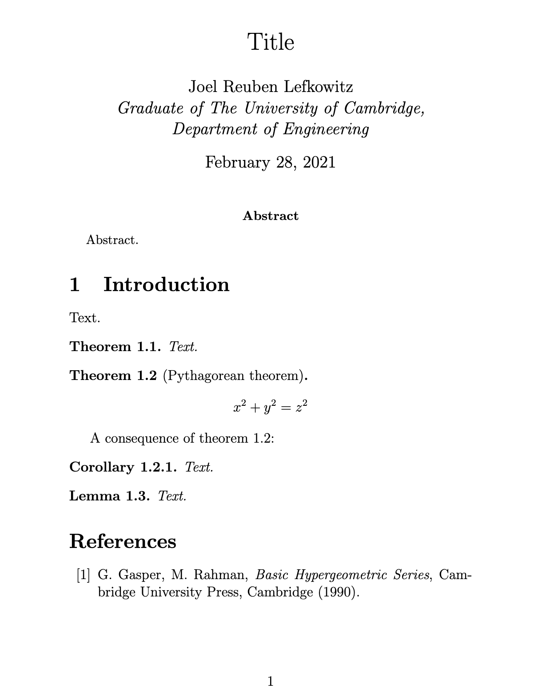

# Latex

Latex template for mathematics.


## Documentation

Documentation and more detailed examples are hosted on [Github Pages](https://joellefkowitz.github.io/latex).

## Usage

Edit the source files as you like and run the build script:

```bash
sh build.sh
```

## Example



## Tooling

### Tests

To run tests:

```bash
npm run test
```

### Documentation

To generate the documentation locally:

```bash
npm run docs
```

### Linters

To run linters:

```bash
npm run lint
```

### Formatters

To run formatters:

```bash
npm run format
```

## Contributing

Please read this repository's [Code of Conduct](CODE_OF_CONDUCT.md) which outlines our collaboration standards and the [Changelog](CHANGELOG.md) for details on breaking changes that have been made.

This repository adheres to semantic versioning standards. For more information on semantic versioning visit [SemVer](https://semver.org).

Bump2version is used to version and tag changes. For example:

```bash
bump2version patch
```

### Contributors

- [Joel Lefkowitz](https://github.com/joellefkowitz) - Initial work

## Remarks

Lots of love to the open source community!

<p align='center'>
    
    
    
</p>
