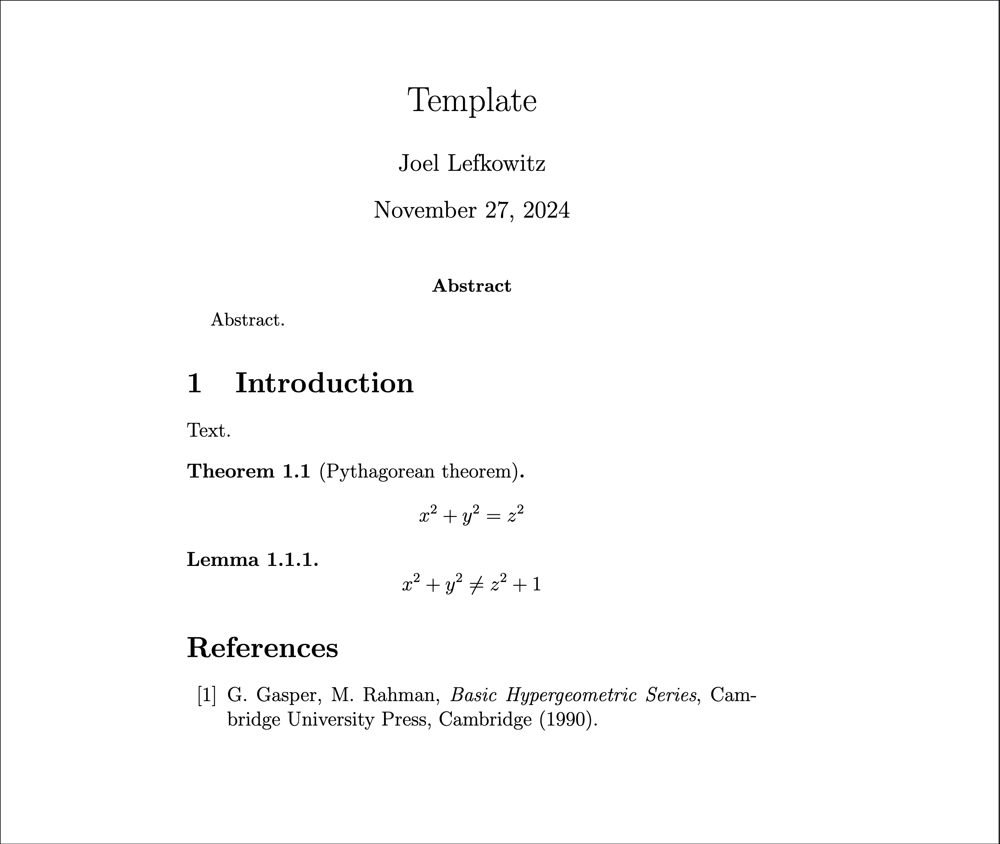

# Latex Jinja

Latex templating with Jinja and PDF conversion.


## Example

Copy the template files:

```
python -m latex-jinja init
```

```properties
INFO Copied "inputs.json"
INFO Copied "template.tex.j2"
```

This creates a [Jinja](https://jinja.palletsprojects.com) latex template and an inputs file:

`template.tex.j2`

```.j2
\documentclass[12pt]{article}
\begin{document}

\title{ {{title}} }
\maketitle

...

\end{document}
```

`inputs.json`

```json
{
  "author": "Author",
  "title": "Title"
}
```

Run the Jinja templating engine and produce a PDF:

```
python -m latex-jinja build
```

```properties
INFO Loaded inputs from "inputs.json"
INFO Rendered the template "template.tex.j2
INFO Created "article.pdf"
```

This will populate the template and produces a PDF:



## Installing

Download the [TeX distribution](https://miktex.org/), this includes `pdflatex` which is used by this package.

```bash
pip install latex-jinja
```

## Documentation

Documentation and more detailed examples are hosted on [Github Pages](https://joellefkowitz.github.io/latex).

## Tooling

### Dependencies

To install dependencies:

```bash
yarn install
pip install .[all]
```

### Tests

To run tests:

```bash
thx test
```

### Documentation

To generate the documentation locally:

```bash
thx docs
```

### Linters

To run linters:

```bash
thx lint
```

### Formatters

To run formatters:

```bash
thx format
```

## Contributing

Please read this repository's [Code of Conduct](CODE_OF_CONDUCT.md) which outlines our collaboration standards and the [Changelog](CHANGELOG.md) for details on breaking changes that have been made.

This repository adheres to semantic versioning standards. For more information on semantic versioning visit [SemVer](https://semver.org).

Bump2version is used to version and tag changes. For example:

```bash
bump2version patch
```

### Contributors

- [Joel Lefkowitz](https://github.com/joellefkowitz) - Initial work

## Remarks

Lots of love to the open source community!

<div align='center'>
    
    
    
</div>
